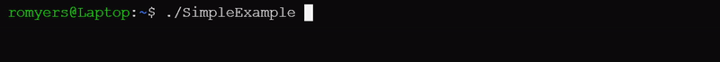

# Simple Progress Bar

[](https://github.com/romyers/SimpleProgressBar/actions/workflows/cmake-multi-platform.yml)

A very, very simple progress bar for C++ console applications.



## Setup

This library is header-only. Just make sure 'SimpleProgressBar.hpp' is present 
in your project's include path, and include it in your project.

CMake integration is also provided, but is not required. You can easily add
this library to a CMake project using the `FetchContent` module:
```cmake
include(FetchContent)
FetchContent_Declare(
    SimpleProgressBar
    GIT_REPOSITORY https://github.com/romyers/SimpleProgressBar
    GIT_TAG v1.0 # Or later version
)
FetchContent_MakeAvailable(SimpleProgressBar)
```
Then link the library to your target, e.g:
```cmake
target_link_libraries(my_target PRIVATE SimpleProgressBar)
```
And include the header in your source files:
```cpp
#include <SimpleProgressBar.hpp>
```

By default, the library will not be built with tests or examples. To build
with tests or examples, run CMake with the `BUILD_TESTING` or `BUILD_EXAMPLES`
option set to `ON`:
```
$ cmake -DBUILD_TESTING=ON -DBUILD_EXAMPLES=ON [path to source directory]
```

See [Testing the Library](#testing-the-library) for more information on running
the test suite.

## Usage

To use the progress bar, simply construct an instance of the ProgressBar class
with the desired number of steps (100 by default), and call `increment()` to 
advance the bar's progress by one step. Then print the progress bar to the 
console (or any ostream) with `print()`.

The `increment()` function takes an optional argument specifying the number of
steps to increment (1 by default). The `print()` function takes the ostream the
progress bar should be printed to.

Several additional methods are provided for customizing the appearance and
behavior of the progress bar. These methods are documented in the
doxygen-generated documentation. See
[Generating the Documentation](#generating-the-documentation)
for information on how to generate the documentation.
An example illustrating their use can be found in 
[examples/CustomizationExample.cpp](examples/CustomizationExample.cpp).

## Example

A short program that demonstrates the use of the progress bar:

```cpp
#include "SimpleProgressBar.hpp"

#include <iostream>

int main() {

    SimpleProgressBar::ProgressBar bar;

    for(int i = 0; i < bar.getTotalSteps(); ++i) {

        bar.increment();

        bar.print(std::cout);

    }

    std::cout << std::endl;

    return 0;

}
```

A further example is provided in the `example` directory, and can be built by 
running CMake with the `BUILD_EXAMPLES` option set to `ON`.

## Testing the Library

A test suite is provided in the `test` directory, using the 
[Catch2](https://github.com/catchorg/Catch2) unit testing
framework. Run CMake with the `BUILD_TESTING` option set to `ON` to download
Catch2 and build the tests:
```
$ cmake -DBUILD_TESTING=ON [path to source directory]
$ make
```
Then run the tests with the `ctest` command:
```
$ ctest
```

## Generating the Documentation

The full documentation for Simple Progress Bar can be generated using cmake
with:
```
$ make docs
```
provided that Doxygen is installed on your system. The generated documentation
will be placed in the 'docs/doxygen' directory.
